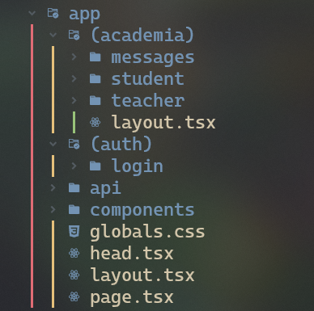
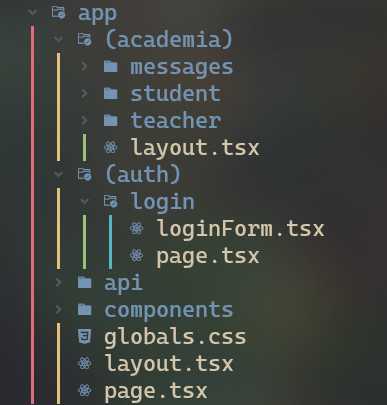

# Cambios en el Front End

## Tipografía
Se agregó en los estilos globales la tipografía Inter (regular 400 y bold 700).
Dependiendo de las necesidades y de las indicaciones de diseño se pueden agregar más variantes de la fuente.

## API Metadata
Next 13 cambió la manera de trabajar con la Metadata, anteriormente se tenía un componente Head que contenía esta información, ahora es una *constante* que puede estar ubicada en los archivos de Layout o de Page.

Esto es muy importante ya que se pueden tener diferentes títulos en las pestañas dependiendo de la página en la que se encuentra el usuario. También puede tener funcionalidad y cambiar el título al recibir un mensaje en el chat.

Son muchas las posibilidades, pueden encontrar más información de esta característica en la documentación oficial de Next https://beta.nextjs.org/docs/api-reference/metadata

:::info Ícono Dinámico
Anteriormente se tenía un ícono dinámico en la pestaña del proyecto. Este cambiaba de color dependiendo del tema del navegador (claro y oscuro). Actualmente con esta nueva característica no se ha conseguido volver a implementar esta funcionalidad en el proyecto, así que el ícono que está es estático.
:::

## Nueva organización carpeta app
### Route Groups
Para la integración de la página de Login se realizaron cambios en la organización de la carpeta app. 
Para ello se utilizó la característica de Next llamada [Route Groups](https://beta.nextjs.org/docs/routing/defining-routes#route-groups).

La carpeta app se dividió en dos grupos (auth y academia). Estos Route Groups son para simplemente organizar las carpetas, no hay cambios en las URL. (Por eso están entre paréntesis).
Esto también permite tener layouts diferentes dependiendo del grupo.

Si tienen alguna duda lean la documentación oficial de next sobre los [Route Groups](https://beta.nextjs.org/docs/routing/defining-routes#route-groups).

### Componentes
En next 13 no es necesario tener todos los componentes en una sola carpeta de *Components*,
pueden poner los componentes en cualquier parte de la carpeta app. 

Por ejemplo estoy en la carpeta de la ruta `/login` y voy a crear un componente para el formulario de login. 
Como este componente solo se va a usar en esta página puedo ponerlo en la misma carpeta con el archivo Page.tsx de la ruta `/login`. 
Y en mi archivo Page.tsx puedo importarlo así `import LoginForm from './loginForm'`.

