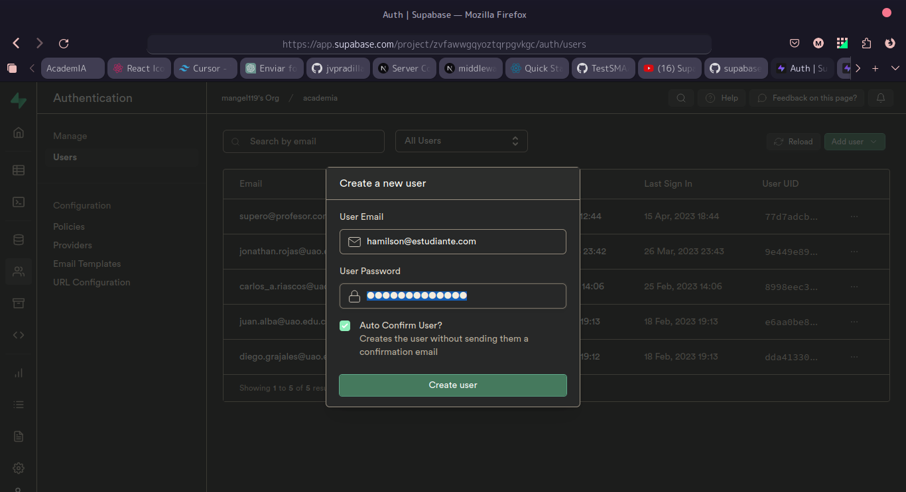
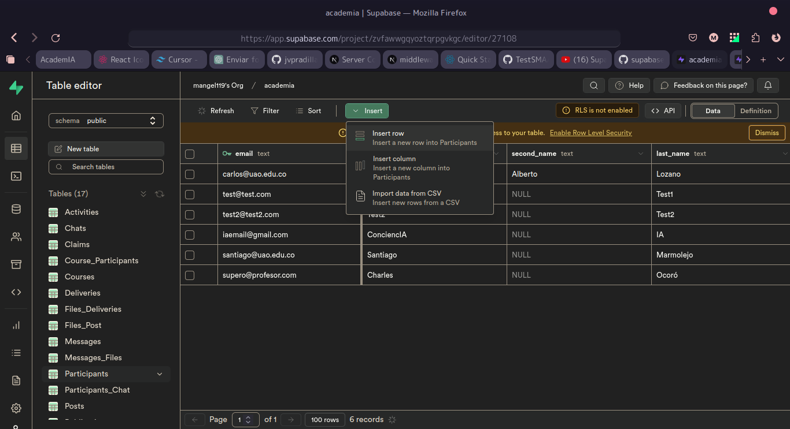
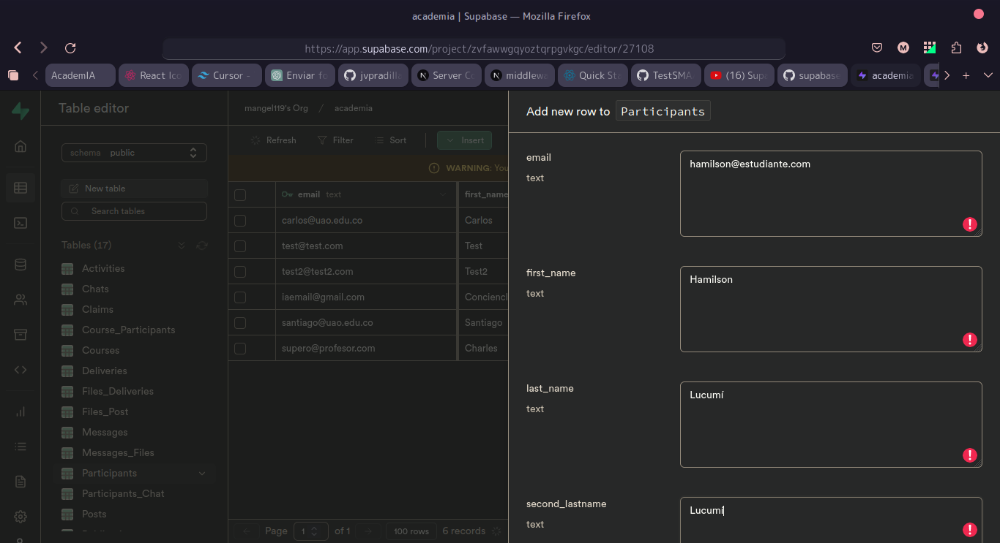

# Sistema de Login
Se implementó el sistema de Login y Autenticación de usuario usando el Servicio de Supabase.
Esto permite conectar a los usuarios registrados con la información de la base de datos.

Las rutas se encuentras protegidas.
Esto quiere decir que si un usuario intenta acceder a la plataforma sin haber inciado sesión no se le permitirá
y lo redireccionará a la página de login.
Lo mismo sucede si un usuario *profesor* intenta acceder a la plataforma de estudiante lo devolverá a su plataforma de profesor.
Con el usuario *estudiante* sucede lo mismo si intenta acceder a la plataforma de profesor.
## Credenciales
Los desarrolladores backend son los encargados de crear usuarios.
Sin embargo desde infraestructura se crearon estos usuarios de prueba para poder seguir con el desarrollo.

### profesor
**email** supero@profesor.com
**contraseña** profesor123
### estudiante
**email** estudiante@estudiante.com
**contraseña** estudiante123

## Crear usuarios
El proceso de creación de usuarios consta de dos partes para poder funcionar correctamente.
### 1. Registro de usuarios en Auth
En la sección de Auth ubicada a la izquierda está toda la información de los usuarios ya registrados.
Deben dar click en el botón que dice `Add user`.
Colocan el correo y la contraseña correspondiente a ese usuario.

Deben recordar o anotar la contraseña ya que Supabase almacena es un token encriptado de dicha contraseña para mayor seguridad. Dejan seleccionada la opción de auto-confirmar.

### 2. Creación de la información del Usuario
Luego de registrar el correo y la contraseña debemos agregar la información correspondiente al usuario registrado.

Se dirigen a la sección de *Table Editor*, y luego a la tabla de `Participants` 
aquí es donde se guarda la información de los participantes.

Le dan click al botón `Insert row` para agregar una nueva fila con información de un usuario.
En la ventana que les aparece es donde ingresarán la información del usuario que registraron como el nombre, rol, entre otros.

:::caution ¡Atención!
Deben prestar mucha atención que el email utilizado en el primer paso debe ser igual al email utilizado en el segundo paso para poder funcionar.
:::

Con estos pasos ya pueden iniciar sesión en la plataforma.

## Utilizar la información del usuario que inició sesión
Se agregaron nuevos Client de supabase, en el siguiente video se muestra como crear una API 
que traiga la información de la base de datos dependiendo del usuario que inició sesión.

https://youtu.be/Y2nPEWrSfic?t=1587
