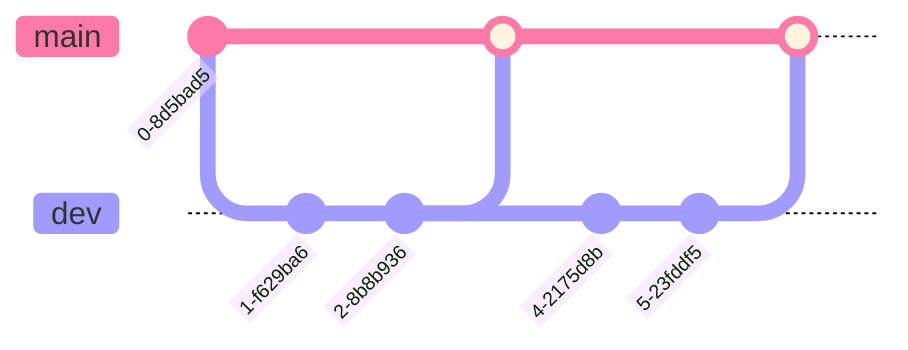

import Tabs from "@theme/Tabs";
import TabItem from "@theme/TabItem";

# Branching

En Git las Ramas son **espacios** o **entornos independientes** para que un Desarrollador sea Back-end, Front-end, Tester, etc. pueda usar y así trabajar sobre un mismo proyecto sin dañar o borrar el conjunto de archivos originales del proyecto, **dándonos flexibilidad para desarrollar nuestro proyecto de manera más organizada**.

Para mayor información sobre las ramas puedes revisar la documentación que se encuentra en **[Github](https://docs.github.com/es/pull-requests/collaborating-with-pull-requests/proposing-changes-to-your-work-with-pull-requests/about-branches)**.

## ¿Qué es una estrategia de Branching?

Es una **serie de reglas** que aplica un equipo de desarrollo de software cuando necesita escribir un código para **incorporar una nueva funcionalidad** o **hacer una corrección**, fusionarlo y enviarlo al repositorio donde se encuentra alojado el resto del código del software en uso, por ejemplo, en un sistema de control de versiones como Git.

Los desarrolladores de software que trabajan en equipo en la misma base de código deben compartir sus cambios entre sí. Pero, ¿cómo pueden hacer esto de manera eficiente mientras evitan inconsistencias en el software?.

El objetivo de cualquier estrategia de branching es resolver precisamente ese problema, permitir que los equipos que trabajan juntos en la misma base de código fuente no afecten su código los unos a los otros.

## Estrategia de Branching: Github Flow

La estrategia de Branching que se definió para el proyecto es **[GitHub Flow](https://docs.github.com/es/get-started/quickstart/github-flow)**. Esta se basa en un flujo de trabajo basado en branches que permite a equipos de desarrollo enfocarse principalmente en la **entrega continua**.

Esta estrategia está basada principalmente en **dos branches** que tienen una vida infinita

- **main** Es usada para propósitos de producción. Contiene el código de la aplicación tal y cómo se le entregará al usuario.
- **dev** Es donde ocurre todo el trabajo de desarrollo, a partir de esta rama se crean las subramas o ramas adicionales. Una vez se ha testeado y asegurado de que no tenga errores, mandamos los cambios a producción en la rama **main**

Adicionalmente en esta estrategia se utilizan otros dos tipos de ramas adicionales que llamaremos **subramas**. Estas subramas **son creadas por los desarrolladores**, y tienen un ciclo de vida temporal, una vez se han fusionado con la rama **dev** estas deben ser eliminadas.

En estas **subramas** los desarrolladores deben hacer las **pruebas unitarias** antes de mandarlas a ser revisadas por **Infraestructura**.

- **feature** Se crea a partir de **develop** cuando una nueva funcionalidad necesita ser desarrollada. Al finalizar el desarrollo se hace merge a **develop** nuevamente.
- **hotfix** Se crea a partir de **main** cuando es necesario corregir un error detectado en producción de manera urgente. Al finalizar el desarrollo se hace merge a **develop** y luego nuevamente a **main**.

:::info ¡Información Importante!

Los desarrolladores son los que crean sus ramas dependiendo del **feature** o del **hotfix** en el cual se encuentren trabajando. Al momento de crearlas estas deben seguir unas reglas con el nombre:

<Tabs groupId="nomenclatura">
  <TabItem value="feat" label="Feature Nomenclatura">
    feature/module_nombre-de-la-funcionalidad
  </TabItem>
  <TabItem value="fix" label="Hotfix Nomenclatura">
    hotfix/module_nombre-del-error
  </TabItem>
</Tabs>
<Tabs groupId="nomenclatura">
  <TabItem value="feat" label="Feature Ejemplo">
    feature/estudiante_informacion-del-curso
  </TabItem>
  <TabItem value="fix" label="Hotfix Ejemplo">
    hotfix/chat_ajuste-color-fuente
  </TabItem>
</Tabs>

(_module_ es el área en el cual se está trabajando la **feature** o el **hotfix**. Estas áreas son: estudiante, profesor, ia, chat, general, infraestructure)

:::
