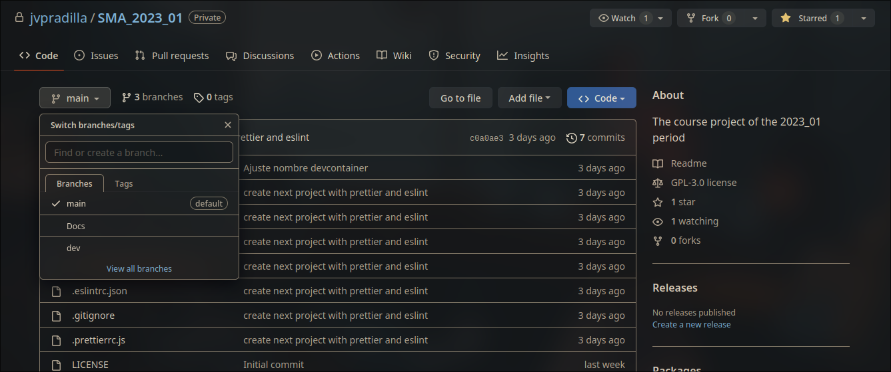
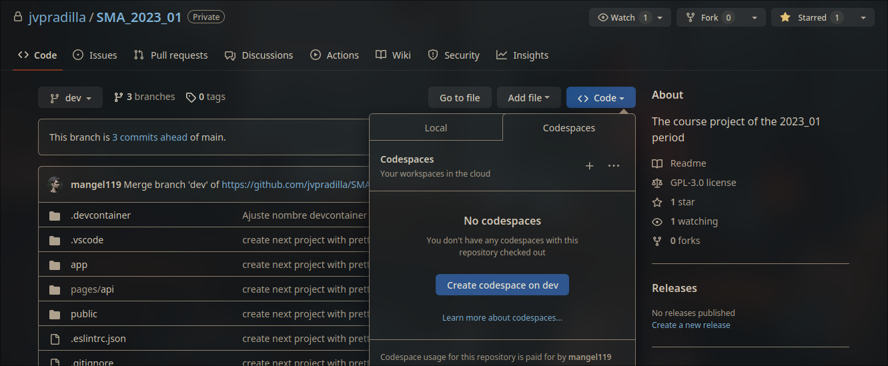
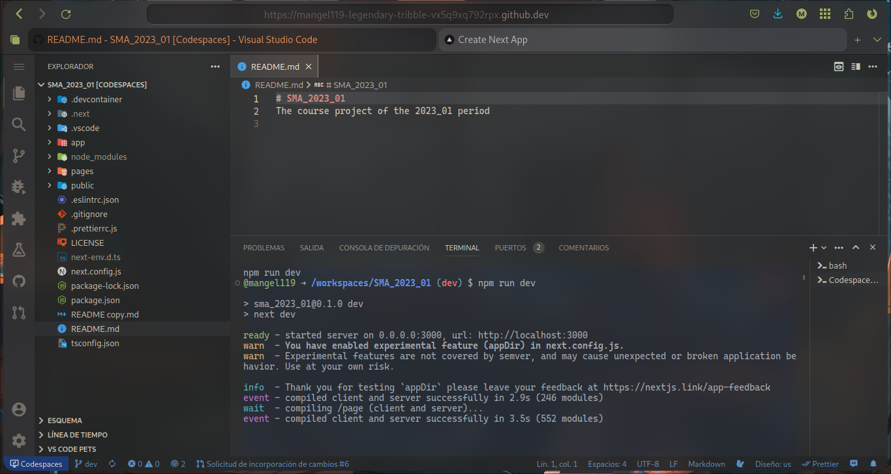
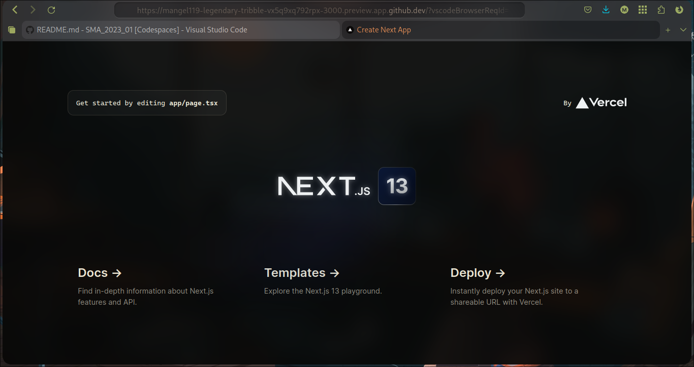

# Entrar al entorno de desarrollo

:::note Repositorio
Puedes acceder al repositorio por medio del siguiente link **[github.com/jvpradilla/SMA_2023_01](https://github.com/jvpradilla/SMA_2023_01)**.
:::

## Primer Paso

Al entrar al repositorio te encontrarás algo como la siguiente imagen, presiona en el botón que dice **main** para cambiar de rama. Selecciona la rama **dev** para trabajar en ella.

## Segundo Paso

Una vez estés en la rama **dev** presiona el botón a la derecha que dice **code**.

Se te abrirá una pequeña ventana con dos opciones para trabajar en el repositorio (Local y Codespaces). En nuestro caso utilizaremos el entorno preparado y configurado para el proyecto de **Codespaces**.

Nos aseguramos de que el botón diga `Create codespace on dev`. Y damos click.

:::tip Trabajar en el repositorio de manera local
Si estás más acostumbrado y prefieres trabajar en el repositorio clonándolo de manera local puedes hacerlo libremente. Pero recomendamos utilizar el entorno que fue preparado en el **Codespaces**.

Recuerda que para poder clonar de manera local el repositorio debes tener configurada en tu computador **únicamente** tu **cuenta institucional** de Github, de lo contrario el sistema no te dejará clonar el repositorio.
:::

## Tercer Paso

Al crear el **codespace** se abrirá una nueva pestaña del navegador con una interfaz muy similar a **Visual Studio Code**. Este entorno fue preparado para automáticamente instalar las extensiones, dependencias, formatos y configuraciones necesarias para el desarrollo del proyecto, por esta razón es el método que recomendamos seguir para trabajar.

Todos los cambios que guardes en el **Codespace** quedan guardados en la nube para que puedas seguir trabajando en el mismo punto que lo dejaste desde cualquier lugar (incluso desde otro computador) accediendo al **Codespace** en el [repositorio de Github](https://github.com/jvpradilla/SMA_2023_01) a través de un navegador.

## Cuarto Paso

El entorno de desarrollo está programado para que automáticamente instale las dependencias y abra el proyecto. Este se encuentra ejecutando en una máquina virtual proporcionada por Github, así que no está consumiendo los recursos propios de tu computador.

Cada cambio que guardes en el entorno de desarrollo se ve reflejado automáticamente en la previsualización.

Ya el proyecto fue creado ejecutando el comando `npx create-next-app`, y el proyecto que se ve en la imagen es el proyecto que viene por defecto. Ustedes como desarrolladores deben editar y **trabajar sobre este proyecto**.

:::caution Errores durante la ejecución
Algunos navegadores bloquean la ejecución del proyecto y muestran una ventana que da la opción de abrirlo en una nueva pestaña, seleccionen esa opción. En caso de que no les aparezca esa ventana, presionen `ctrl + click` sobre el link de `localhost:3000/` que está en la terminal.

Si el proyecto no se abre automáticamente, no se ejecuta ningún código o aparece algún error comunícate con alguno de los encargados de **Infraestructura** a través del Discord.
:::
