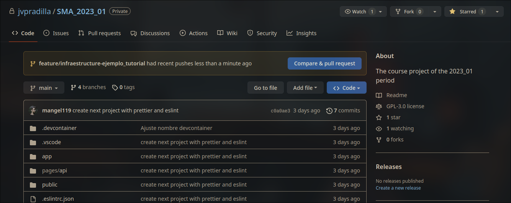
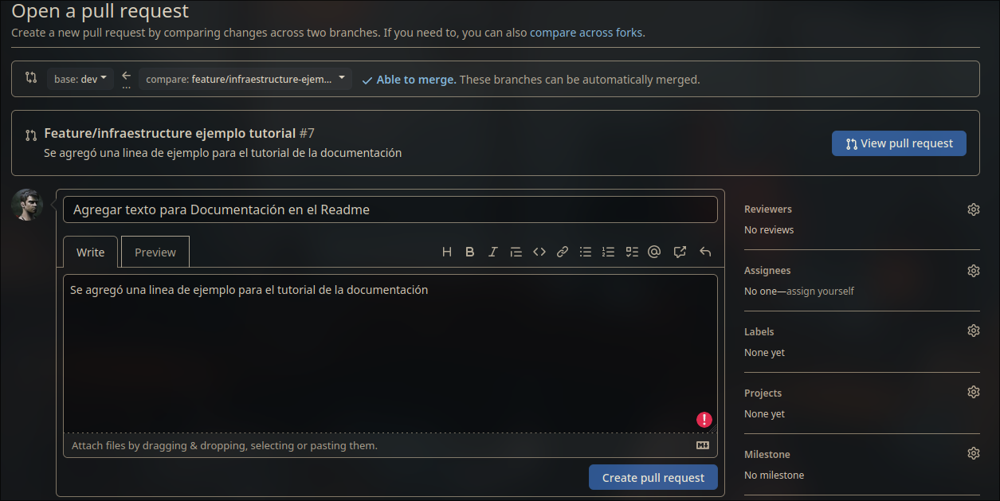
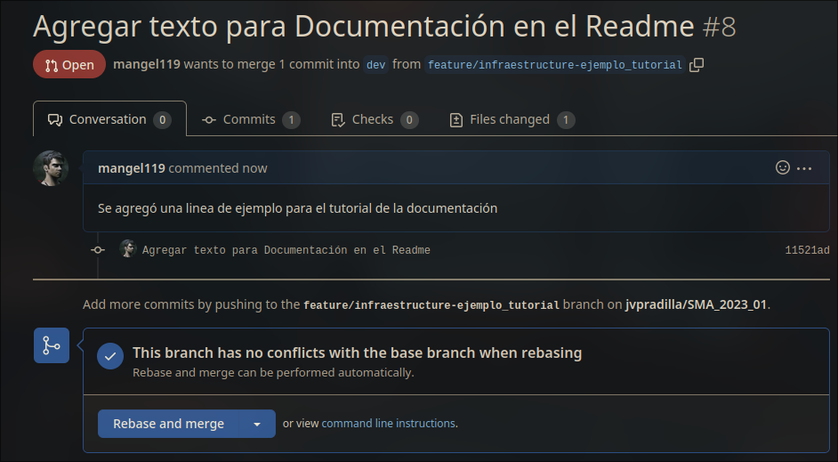

# Pull Request

Un **pull request** es una petición para integrar nuestras funcionalidades o cambios de código a la rama de **dev** y posteriormente a la rama **main**. Pasando por una revisión a cargo del rol de **infraestructura** donde la propuesta puede ser aceptada o no.

## Primer Paso

Cuando una funcionalidad queda finalmente terminada, es decir, se cumplen todos los **criterios de validación** y pasó todas las **pruebas unitarias**, se debe realizar un **Pull Request** para solicitar la integración de la funcionalidad en la rama **dev** por medio de un **merge** que fusione ambas ramas.

Para solicitar este **Pull Request** debemos irnos a la página del repositorio. Y vemos que tenemos un mensaje como el que se muestra en la imagen, donde se nos dice que nuestra rama **feature** tiene push recientes, es decir, que se han subido cambios recientemente. Le damos click en el botón que dice `Compare & Pull Request`.

## Segundo Paso

Esto nos llevará a una página donde creamos nuestro **Pull Request**. Le colocamos un título y una descripción **bien detallada** de la funcionalidad que se implementó. Y creamos nuestra **Pull Request** en el botón de abajo `Create Pull Request`.

:::caution ¡Cuidado!
Deben asegurarse que en la parte de arriba esté `base:dev` y al lado `compare: y el nombre de su rama feature`. Esto es muy importante para que se pueda hacer el merge en la rama correcta.

Tanto las ramas **feature** como **hotfix** deben hacerse su **Pull Request** a la rama **dev**.
:::

## Tercer Paso

Luego de crear el **Pull Request** aparecerá una página como la siguiente:

Hasta aquí termina su trabajo como desarrolladores, así les salga la opción de hacer merge **NO lo hagan**, deben esperar la revisión desde **Infraestructura**. Si les aparece que hay conflictos no se asusten, para eso está **Infraestructura** que se encargará de solucionar esos conflictos y hacer el **merge** de las ramas.

Nosotros como **Infraestructura** estamos pendientes de las solicitudes así que no es necesario que nos escriban, atenderemos cada solicitud a su debido tiempo.

:::info ¡Recuerden!
Si tienen dudas, dificultades o sugerencias durante el proceso pueden escribir en los canales de **Infraestructura** en el Discord etiquetando a cualquiera de los dos para poderlos atender.
:::
