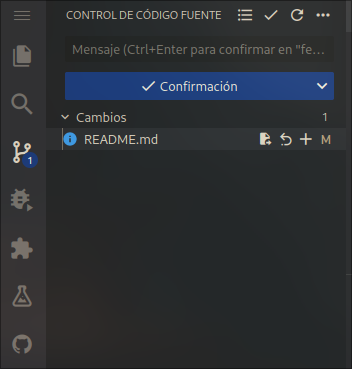
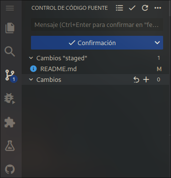
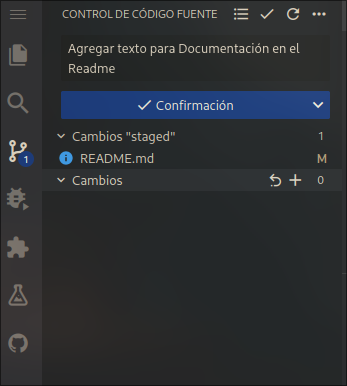
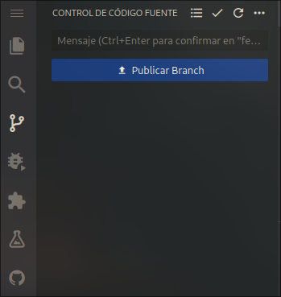

# Subir los cambios

## Primer Paso

Luego de realizar los cambios en el código queremos subirlos. Para ello haremos un **commit**. El codespace nos simplifica mucho el proceso y nos muestra los cambios que hemos hecho en el proyecto.

## Segundo Paso

Antes de realizar un **commit** debemos preparar los archivos que queremos subir. Para ello presionamos el `+` para agregarlos y que queden en un estado llamado **staged**.

## Tercer Paso

**Siempre** antes de subir cambios debemos escribir un mensaje que explique de una manera muy breve los cambios que realizamos. Se recomienda que estos inicien con un verbo en infinitivo. Y le damos click en confirmar.

:::tip Tip
Se recomienda subir commits regularmente a la rama **feature** en la que está trabajando, no esperar a cuando esté la funcionalidad terminada para realizar el primer commit. Esto con el fin de mantener un **historial** de trabajo y también sea más fácil volver a cierto punto en caso de algún error.
:::

## Cuarto Paso

Nos aparecerá la opción de subir los cambios, como acabamos de crear esta rama nos aparecerá la opción de `publicar Branch`, si estamos trabajando en una rama que ya habíamos creado y realizado commits anteriormente nos aparecerá `sincronizar cambios`. En cualquiera de las dos opciones le damos click y esto subirá los cambios que hayamos hecho al Github.

:::note Nota
En algunas ocasiones habrán dos desarrolladores trabajando en la misma funcionalidad (No se recomienda más de dos en una misma funcionalidad). Y ambos estarán trabajando en la misma rama **feature**, deben estar en constante comunicación, para saber de los cambios que suba el otro desarrollador, y que estos no afecten el trabajo del otro.
:::
