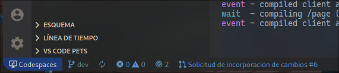
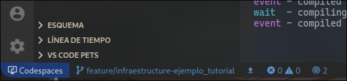
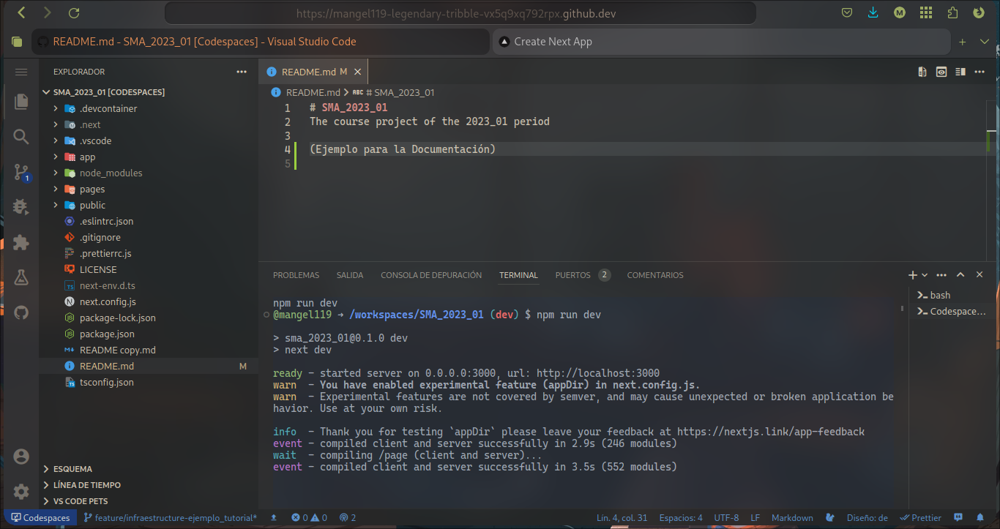

# Trabajar en el entorno de desarrollo

## Primer Paso

:::danger
La rama **dev** funciona solo **de referencia**. **NO** deben trabajar sobre ella. Deben crear su propia rama de **feature** para trabajar en determinada funcionalidad.
:::

Para comenzar a trabajar en nuestras **Historias de Usuario** debemos crear una rama de **feature**. Esta rama se utiliza para implementar una funcionalidad específicamente. No se recomienda utilizar una misma rama de **feature** para dos o más funcionalidades. Una vez terminada de implementar la funcionalidad y esta sea fusionada a la rama **dev**, esa rama de **feature** debe ser eliminada.

## Segundo Paso

Para crear nuestra rama **feature** damos click en la esquina inferior izquierda donde dice **dev**.



Esto nos abrirá un cuadro de diálogo donde podremos cambiar de rama o crear una nueva. Seleccionamos la opción que dice `Crear rama a partir de...` y seleccionamos la opción `origin/dev`.

Se nos pedirá que coloquemos el nombre de la nueva rama, para esto debemos seguir la **Nomenclatura** de las ramas **feature**:

```
feature/module_nombre-de-la-funcionalidad
```

Primero se especifica si es una rama tipo **feature** o **hotfix**, se agrega el `/`, se coloca el **module** al cual pertenece (estudiante, profesor, ia, chat, general, infraestructure) Se utiliza un **guión bajo** `_`como separación y finalmente se coloca el nombre de la funcionalidad separando las palabras por medio de **guiones medios** `-`. Algunos ejemplos pueden ser:

```
feature/general_sidebar
feature/profesor_tablon-anuncios
hotfix/estudiante_imagen-perfil-no-mostrada
```



:::info Subramas **feature** y **hotfix**
Recuerda que las subramas **feature** que creas deben ser a partir de la rama **dev**. Y las subramas **hotfix** deben ser a partir de la rama **main**.
:::

## Tercer Paso

Con la rama **feature** creada ya puedes trabajar en el código. En este caso de ejemplo editamos el archivo **Readme.md** y escribimos en la línea 4.


